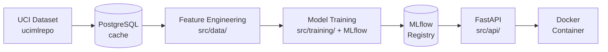

# MedPredict

Heart disease risk prediction API trained on the UCI Heart Disease dataset, served with FastAPI, tracked with MLflow, and containerised with Docker.


---

## Overview

MedPredict trains four classifiers — Logistic Regression, Random Forest, Gradient Boosting, and a PyTorch MLP — on the UCI Heart Disease dataset (Cleveland subset, 303 patients, 13 features). All experiments are logged to MLflow. The best model is served through a production-ready FastAPI endpoint packaged as a multi-stage Docker image.

---

## Architecture



### Request lifecycle

```
POST /predict  (JSON body)
      |
      v
  PredictRequest  (Pydantic v2 validation)
      |
      v
  pd.DataFrame  (one row)
      |
      v
  model.predict_proba()  (sklearn pipeline or TorchModel)
      |
      v
  PredictResponse  { prediction, probability, model_version }
```

---

## Project structure

```
medpredict/
├── src/
│   ├── data/
│   │   ├── download.py       # fetch_dataset() via ucimlrepo
│   │   ├── preprocess.py     # binarise_target, build_preprocessing_pipeline, split
│   │   ├── features.py       # add_age_group, compute_chol_age_ratio, engineer_features
│   │   └── pipeline.py       # run_pipeline() end-to-end orchestrator
│   ├── models/
│   │   ├── base.py           # BaseModel ABC (fit / predict / predict_proba / save / load)
│   │   ├── logistic_model.py # LogisticModel
│   │   ├── random_forest_model.py  # RandomForestModel
│   │   ├── sklearn_model.py  # SklearnModel (GradientBoosting)
│   │   ├── torch_model.py    # TorchModel (MLP)
│   │   └── registry.py       # load_model() / get_model_path()
│   ├── api/
│   │   ├── main.py           # FastAPI app + lifespan model loading
│   │   ├── schemas.py        # PredictRequest / PredictResponse (Pydantic v2)
│   │   ├── dependencies.py   # get_model() FastAPI dependency
│   │   └── routers/
│   │       └── predict.py    # POST /predict
│   └── training/
│       ├── train.py          # main() — trains all baselines, logs to MLflow
│       └── evaluate.py       # full_report() helper
├── tests/                    # mirrors src/ layout
├── notebooks/                # EDA only
├── docs/                     # architecture.md, model-card.md
├── models/                   # serialised artefacts (git-ignored)
├── scripts/
│   └── start.sh              # container entrypoint
├── Dockerfile
├── docker-compose.yml
└── pyproject.toml
```

---

## Quick start

### Option A — Docker Compose (recommended)

```bash
git clone https://github.com/your-org/medpredict.git
cd medpredict
cp .env.example .env
# Set POSTGRES_PASSWORD and other values in .env
docker compose up --build
```

The API is available at `http://localhost:8000`.
MLflow UI is available at `http://localhost:5000`.

### Option B — Local Python environment

```bash
git clone https://github.com/your-org/medpredict.git
cd medpredict
python -m venv .venv
source .venv/bin/activate      # Windows: .venv\Scripts\activate
pip install -e ".[dev]"
cp .env.example .env
# Edit .env — at minimum set MODEL_PATH and MLFLOW_TRACKING_URI
```

Train all baselines:

```bash
python -m src.training.train
# or the installed script:
medpredict-train
```

Serve the API:

```bash
uvicorn src.api.main:app --reload --port 8000
# or the installed script:
medpredict-serve
```

---

## API usage

### Health check

```bash
curl http://localhost:8000/health
```

```json
{"status": "ok"}
```

### Predict

```bash
curl -X POST http://localhost:8000/predict/ \
  -H "Content-Type: application/json" \
  -d '{
    "age": 54,
    "sex": 1,
    "cp": 0,
    "trestbps": 130,
    "chol": 245,
    "fbs": 0,
    "restecg": 0,
    "thalach": 155,
    "exang": 0,
    "oldpeak": 1.4,
    "slope": 2,
    "ca": 0,
    "thal": 2
  }'
```

```json
{
  "prediction": 0,
  "probability": 0.12,
  "model_version": "1.0.0"
}
```

`prediction` is `0` (no disease) or `1` (disease present). `probability` is the model's estimated probability of disease.

### Model info

```bash
curl http://localhost:8000/model/info
```

### Interactive docs

Browse to `http://localhost:8000/docs` for the Swagger UI or `http://localhost:8000/redoc` for ReDoc.

---

## Dataset

- **Source**: [UCI Heart Disease dataset](https://archive.ics.uci.edu/dataset/45/heart+disease) (ID 45)
- **Subset used**: Cleveland (303 patients)
- **Target**: binarised — 0 = no disease, 1 = disease present (original values 1–4 collapsed to 1)

| Feature | Description |
|---------|-------------|
| `age` | Age in years |
| `sex` | Sex (0 = female, 1 = male) |
| `cp` | Chest pain type (0 = typical angina, 1 = atypical, 2 = non-anginal, 3 = asymptomatic) |
| `trestbps` | Resting blood pressure (mm Hg) |
| `chol` | Serum cholesterol (mg/dl) |
| `fbs` | Fasting blood sugar > 120 mg/dl (0/1) |
| `restecg` | Resting ECG results (0–2) |
| `thalach` | Maximum heart rate achieved |
| `exang` | Exercise-induced angina (0/1) |
| `oldpeak` | ST depression induced by exercise relative to rest |
| `slope` | Slope of peak exercise ST segment (0–2) |
| `ca` | Number of major vessels coloured by fluoroscopy (0–4) |
| `thal` | Thalassemia type (0–3) |

**Citation**: Janosi, A., Steinbrunn, W., Pfisterer, M., & Detrano, R. (1988). Heart Disease. UCI Machine Learning Repository. https://doi.org/10.24432/C52P4X

---

## Tech stack

| Component | Technology |
|-----------|-----------|
| Language | Python 3.11 |
| ML — baselines | scikit-learn (LogisticRegression, RandomForestClassifier, GradientBoostingClassifier) |
| ML — neural network | PyTorch 2.x (feed-forward MLP) |
| Experiment tracking | MLflow 2.x |
| API framework | FastAPI + Pydantic v2 |
| ASGI server | Uvicorn |
| Database | PostgreSQL 15 via SQLAlchemy 2.0 |
| Data ingestion | ucimlrepo |
| Containerisation | Docker (multi-stage) + Docker Compose |
| Linting / formatting | Ruff |
| Type checking | mypy (strict) |
| Testing | pytest + pytest-cov |

---

## Environment variables

Copy `.env.example` to `.env` and fill in the values before running.

| Variable | Default | Purpose |
|----------|---------|---------|
| `DATABASE_URL` | `postgresql://localhost:5432/medpredict` | PostgreSQL connection string |
| `MLFLOW_TRACKING_URI` | `http://localhost:5000` | MLflow server address |
| `MODEL_PATH` | `models/best_model.pkl` | Path to the serialised model file loaded at API startup |
| `POSTGRES_PASSWORD` | *(required for Docker Compose)* | PostgreSQL superuser password |
| `HOST` | `0.0.0.0` | Bind address for Uvicorn |
| `PORT` | `8000` | Bind port for Uvicorn |

---

## Development

### Run tests

```bash
pytest                      # all tests with coverage report
pytest tests/data/          # data module only
pytest -k "test_predict"    # filter by name
```

### Lint and format

```bash
ruff check --fix .
ruff format .
```

### Type check

```bash
mypy src/
```

### MLflow UI

When running locally, start the tracking server first:

```bash
mlflow server --host 127.0.0.1 --port 5000
```

Then open `http://localhost:5000` to browse experiments and compare runs.

---

## License

MIT — see [LICENSE](LICENSE).
