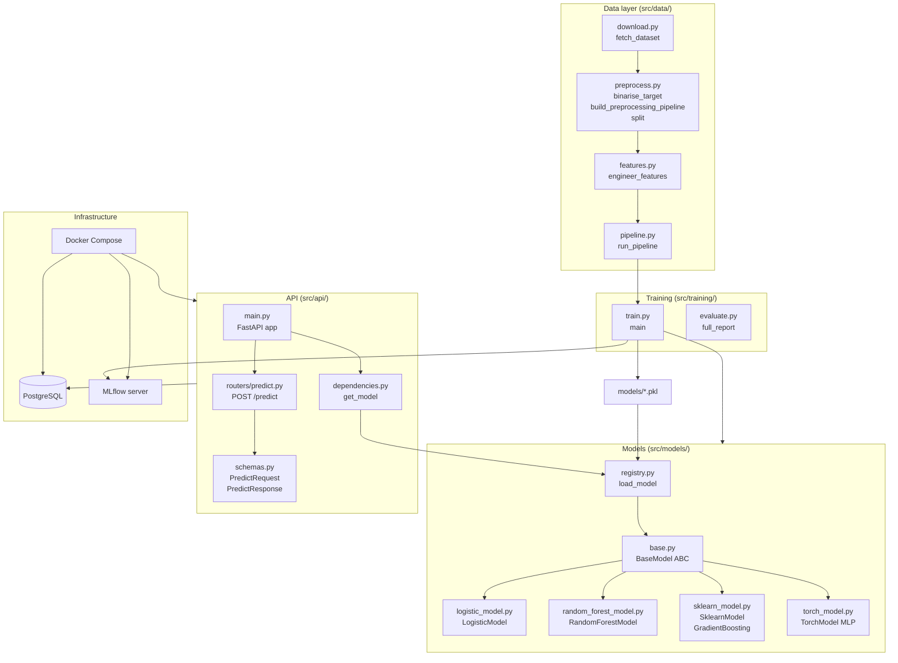
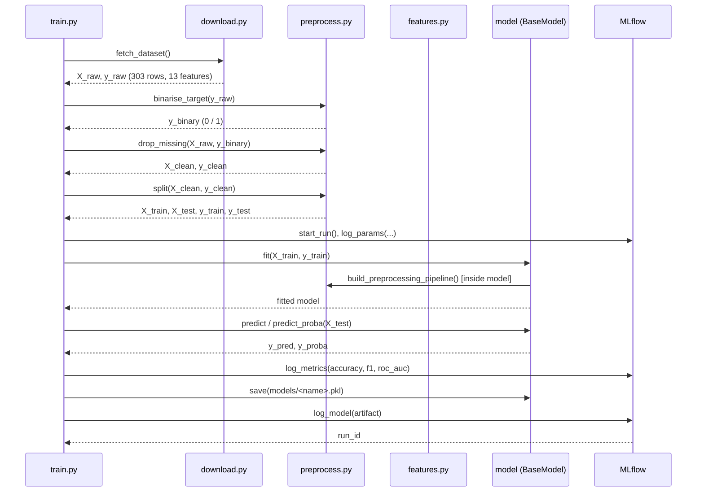
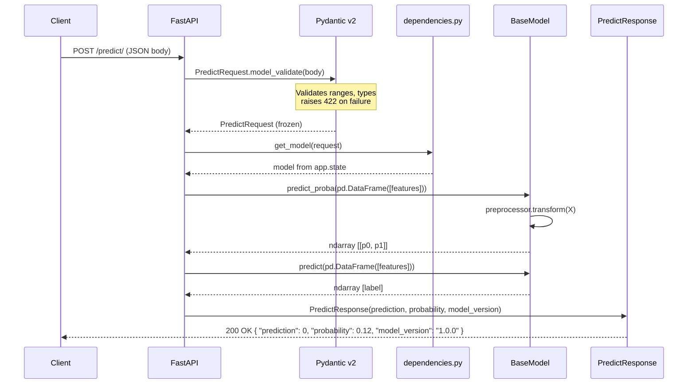

# Architecture

## Component overview

## Data flow: UCI download to trained model

## API request lifecycle

## Key design decisions

| Decision | Rationale |
|----------|-----------|
| Pydantic v2 frozen models | Immutable request/response objects prevent accidental mutation downstream |
| Model loaded in lifespan hook | Errors surface at startup; the model is loaded exactly once rather than per-request |
| `app.state` for model injection | Allows the test suite to swap the model without patching globals |
| SQLAlchemy 2.0 async | Non-blocking DB writes do not add latency to the prediction path |
| Multi-stage Dockerfile | Builder stage installs deps; runtime stage ships only pre-built wheels and app source, keeping the image small |
| MLflow model registry | Enables versioning and stage promotion (staging -> production) across all four model types |
| BaseModel ABC | A single interface for all classifiers makes the training loop, evaluation, and API dependency generic and swappable |
